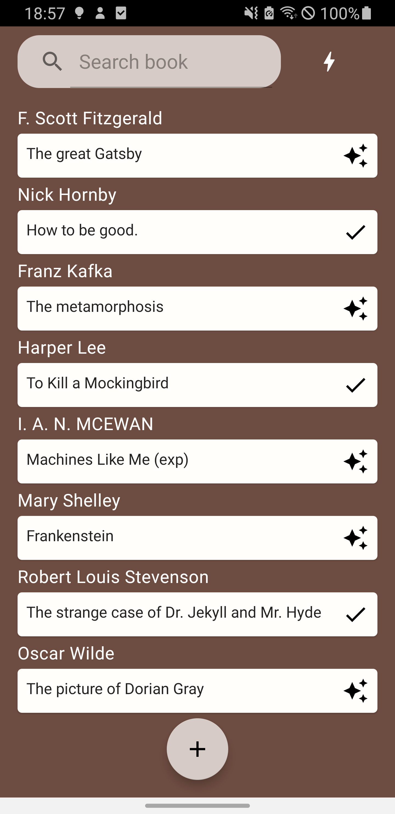
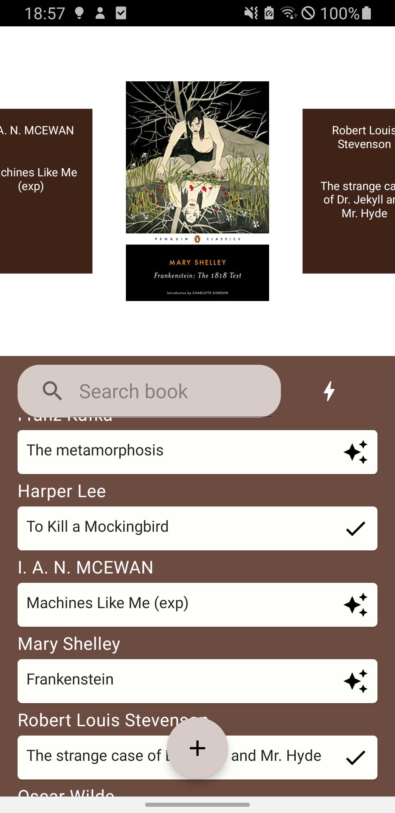
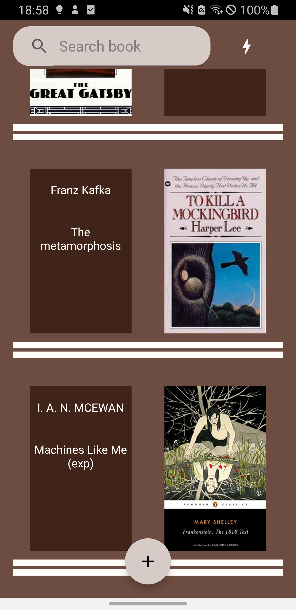
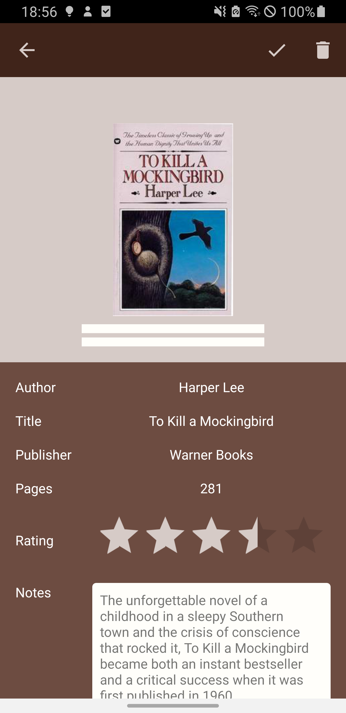
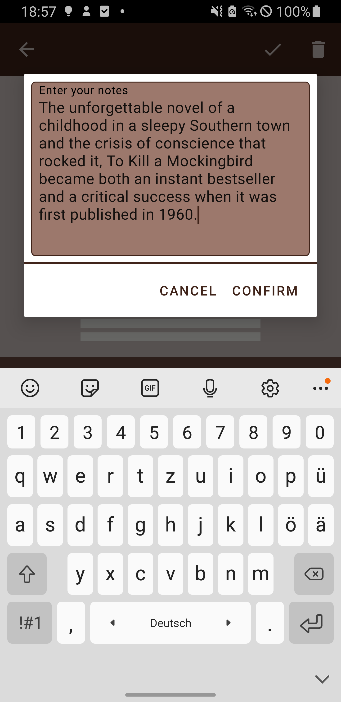
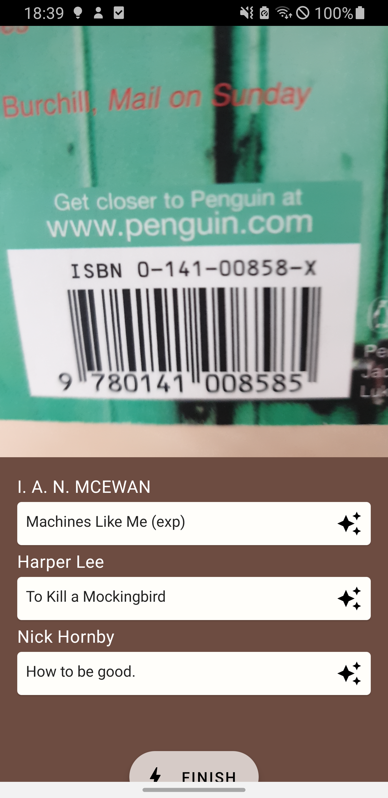

# Alexandria
Archive your local library with the Alexandria Android App.

## Features
- `Archive`: Archive your books by scanning their barcode or entering an ISBN
- `Search`: Search your archive by Author or Title
- `Rating & Notes`: Rate your reading experience & Save your thoughts
- `Marking`: Books can be marked e.g. to save whether you've already read them 

## Modules
- `app`: The application or presentation layer. Contains layouts, fragments, viewmodels, databinding adapters, resources, etc.
- `business`: The business or domain layer. Contains repositories and mediates between `app` and `data`.
- `data`: The data layer. Contains networking code for accessing the backend API & Persistence provider.

## Screenshots

