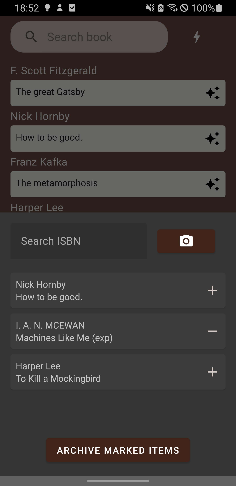

# Alexandria
Archive your local library with the Alexandria Android App.

## Features
- `Archive`: Archive your books by scanning their barcode or entering an ISBN
- `Multiple Layouts`: Browse your library as a list, a book shelf or a combination of both
- `Search`: Search your archive by Author or Title
- `Rating & Notes`: Rate your reading experience & Save your thoughts
- `Marking`: Books can be marked e.g. to save whether you've already read them
- `Accessibility`: The entire app is accessible by a screenreader

## Modules
- `app`: The application or presentation layer. Contains layouts, fragments, viewmodels, databinding adapters, resources, etc.
- `business`: The business or domain layer. Contains repositories and mediates between `app` and `data`.
- `data`: The data layer. Contains networking code for accessing the backend API & Persistence provider.

## Contributions
This app would not be possible without the amazing [OpenLibrary project](https://openlibrary.org/)!

## Screenshots
### Shelf
List | Pager | Grid
:-------------------------:|:-------------------------:|:-------------------------:
 |  | 

### Details
Overview | Edit Notes
:-------------------------:|:-------------------------:
 | 

### Capture
Scan | Dialog
:-------------------------:|:-------------------------:
 | 
